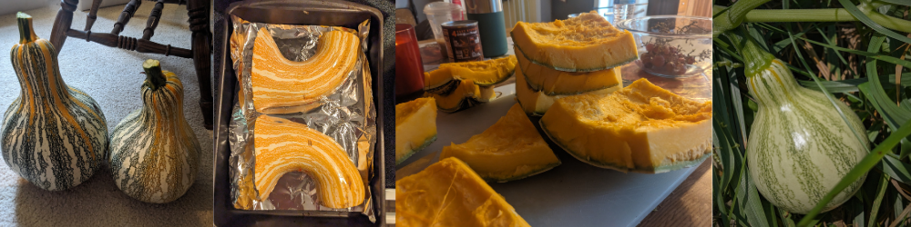

# The Commonwealth Cushaw Project

The guide is intended to help people grow and use tasty, nutritious cushaw squash. The information here about cultivation, recipes, and seed saving have been developed by other squash growers, and is published with an open license.

This guide was initially developed by the Commonwealth Cushaw Project, based in Kentucky, USA. It has been built in part from previous Going to Seed crop guides.

## What is included?

Different types of cushaws have been bred for different purposes, edible seeds, summer squash, and long-keeping winter squash. Most squash traditionally called _cushaws_ are botanically classified as _[Cucurbita arygrosperma](https://en.wikipedia.org/wiki/Cucurbita_argyrosperma)_, but there are some cushaws of species _C. moshchata_. More information about cushaw classification can be found in [What are Cushaws?](what-are-cushaws.md)

This guide was created by people growing C. argyrosperma winter squash cushaws that can be stored fresh for at least six months, but the information can be applied to other types. We welcome contributions to make this guide more useful to people growing the full spectrum of cushaw squash.

## Using and reusing the guide

This guide is offered with a noncommercial creative commons license, [CC BY 4.0](https://creativecommons.org/licenses/by/4.0/). If you publish a revised version, please credit **[Going to Seed](https://goingtoseed.org/)** and **[Handbarrow](https://handbarrow.org/)**, provide a link to the license, and indicate if changes were made. You may do so in any reasonable manner, but not in any way that suggests that Going to Seed and Handbarrow endorses you or your use.